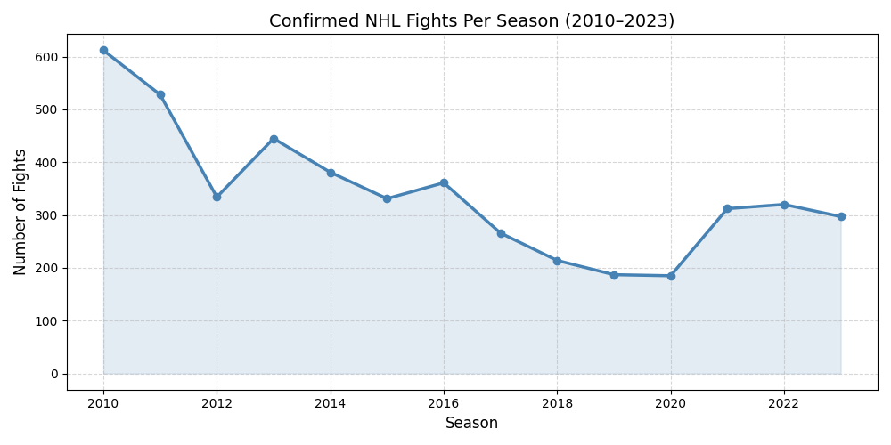
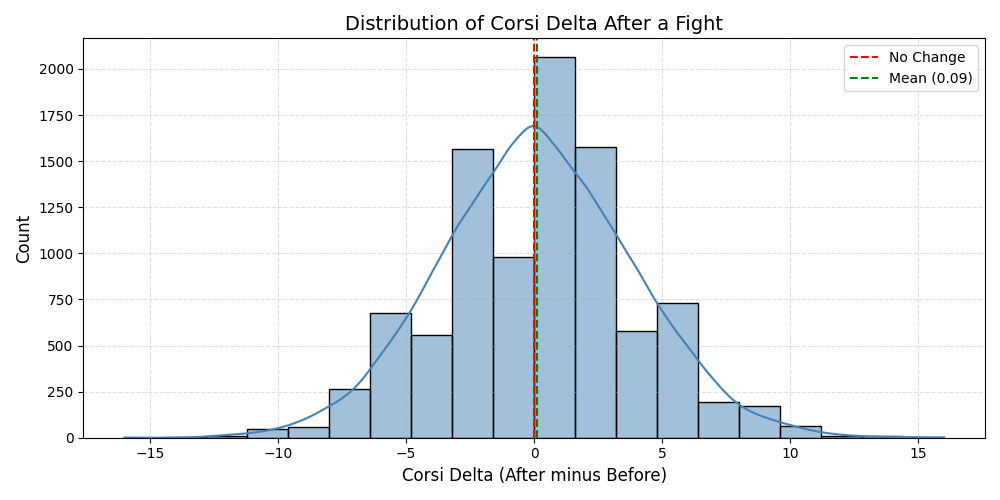
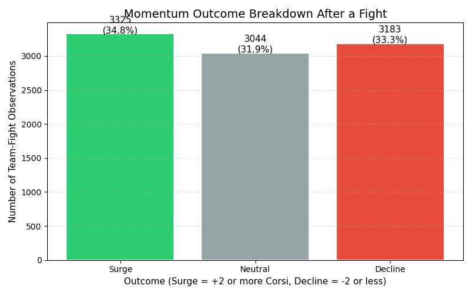
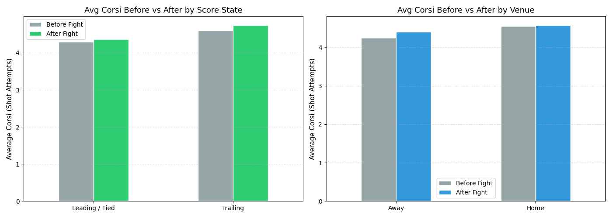
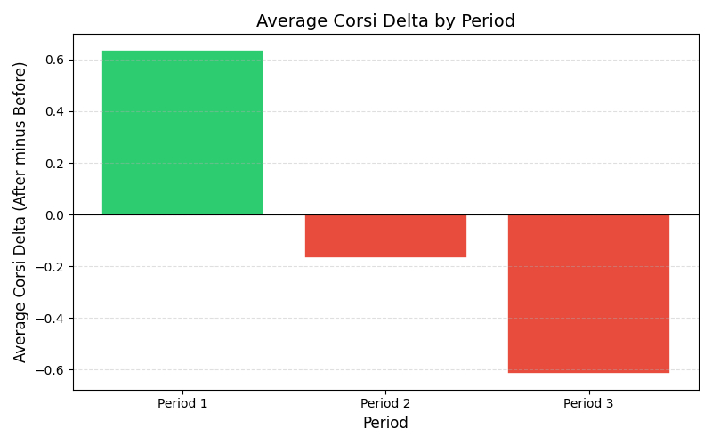
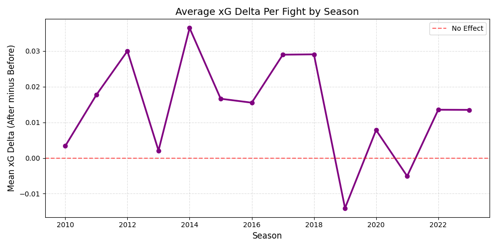
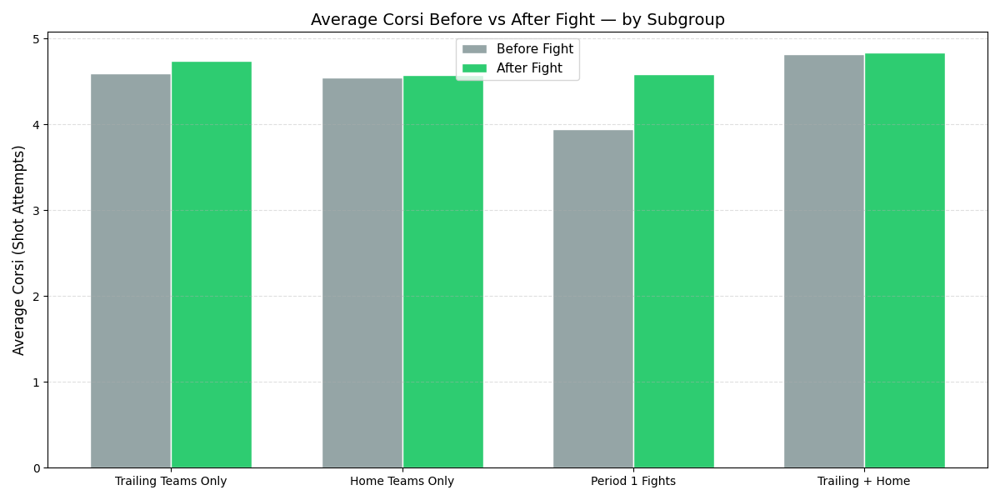
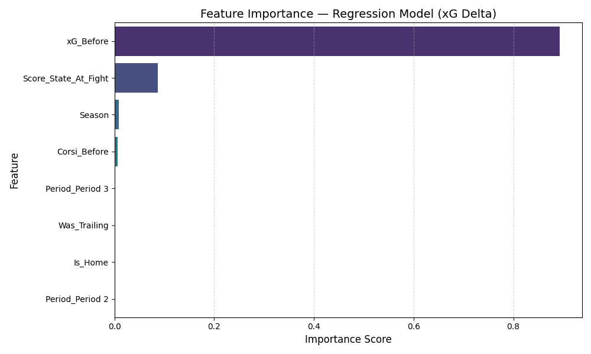
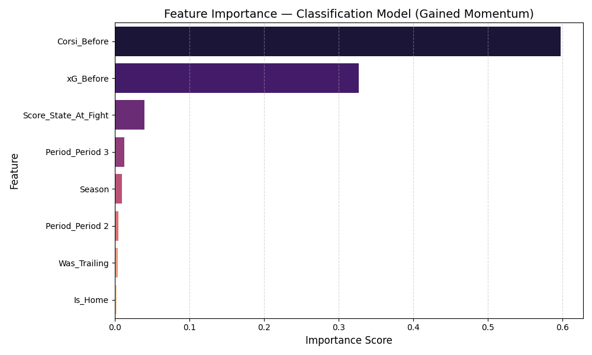

# NHL Fight Momentum Analysis

Fighting has been part of hockey for over a century, but does it actually work? Conventional wisdom says a well-timed fight can swing momentum and energize a team. This project uses 14 years of NHL play-by-play data to test that claim statistically and build a model that predicts when a fight is most likely to generate a meaningful momentum shift.

---

## What This Project Does

I identified every confirmed fight in the NHL from 2010 to 2023, measured each team's offensive output in the 5 minutes before and after the fight, and evaluated whether the shift was statistically significant. From there I built two predictive models to understand which game situations produce the strongest momentum effect.

The short answer: fighting does generate statistically significant momentum, but not uniformly. When it happens matters a lot more than most people assume.

---

## Project Structure

```
nhl-fight-momentum/
├── data/
│   └── NHL_Fight_Momentum_Data.csv
├── notebooks/
│   ├── fight_data_extraction.ipynb
│   └── fight_momentum_analysis.ipynb
├── outputs/
│   ├── Fights_Per_Season.png
│   ├── Corsi_Delta_Distribution.png
│   ├── Momentum_Class_Breakdown.png
│   ├── Corsi_Context_Breakdown.png
│   ├── Corsi_Delta_By_Period.png
│   ├── xG_Delta_By_Season.png
│   ├── Subgroup_Corsi_Comparison.png
│   ├── Feature_Importance_Regression.png
│   └── Feature_Importance_Classification.png
├── .gitignore
├── requirements.txt
└── README.md
```

---

## Data

The raw play-by-play data covers NHL seasons from 2010 to 2023 and comes from [hockey-statistics.com](https://hockey-statistics.com/data/). The file is around 513MB and is not included in this repository. Download it from that link, place it in the `data/` folder, and run the extraction notebook first.

The cleaned output file (`NHL_Fight_Momentum_Data.csv`) is already included so you can go straight to the analysis notebook without the raw data.

**Fight identification:** A fight is defined as two teams both receiving a simultaneous 5-minute major penalty in the same game at the same time. This filters out solo major penalties (boarding, charging, spearing) which only appear on one team. This conservative definition ensures every fight in the dataset is a confirmed altercation, not an edge case.

---

## Features

| Feature | Description |
|---|---|
| `Corsi_Before / After` | Shot attempts in the 5 minutes before and after the fight |
| `Shots_Before / After` | Shots on goal in the same windows |
| `xG_Before / After` | Expected goals — accounts for shot quality, not just volume |
| `Corsi_Delta` | Shot attempt change (After minus Before) |
| `xG_Delta` | Expected goals change (After minus Before) |
| `Gained_Momentum` | Binary — did the team improve their Corsi after the fight? |
| `Was_Trailing` | Whether the team was losing at the time of the fight |
| `Is_Home` | Whether the team was playing at home |
| `Period` | Which period the fight occurred in |
| `Score_State_At_Fight` | Exact score differential at the time of the fight |

---

## Exploratory Data Analysis

**Fights have declined sharply since 2010**

The dataset captures a period of significant cultural shift in hockey. Fights dropped from over 600 per season in 2010 to under 200 by 2019, driven by analytics adoption, player safety awareness, and roster construction philosophy. Later seasons have smaller sample sizes, which is worth keeping in mind when interpreting trends.



**The distribution of momentum shifts is centered near zero but skewed positive**

Across all fights, the average Corsi Delta was +0.09, meaning teams generated slightly more shot attempts after a fight than before. The distribution is wide though — outcomes vary considerably, which is why statistical testing matters more than the raw average.



**Most fights result in a neutral outcome**

Breaking outcomes into three classes — Surge (+2 or more Corsi), Neutral, and Decline (-2 or less) — shows that the majority of fights produce little measurable change in shot attempt volume. The momentum boost from fighting is real on average, but it is not guaranteed in any individual situation.



**Trailing teams show a larger before/after shift than leading teams**

Teams that were losing at the time of the fight showed a more noticeable increase in Corsi after the fight compared to teams that were tied or leading. The home/away split showed less separation than expected.



**Period 1 fights produce the largest momentum shifts**

Fights in the first period showed substantially higher Corsi Delta than fights in the second or third period. This makes intuitive sense — a first period fight leaves more game time to capitalize on the energy boost, while a third period fight may come too late to translate into meaningful offensive pressure.



**The xG momentum effect has fluctuated over time**

As fighting has declined, the remaining fights may be more deliberate and situational rather than spontaneous. The season-by-season xG Delta trend shows whether the quality of momentum generated per fight has shifted as the overall volume of fighting dropped.



---

## Statistical Testing

A **paired t-test** was used to evaluate whether the before/after momentum shift is statistically significant. A paired design is appropriate here because every observation has both a before and after measurement for the same team in the same game — we are comparing paired measurements, not two separate groups.

**Overall Results**

| Metric | Mean Delta | P-Value | Significant? |
|---|---|---|---|
| Corsi (shot attempts) | +0.0946 | 0.0152 | Yes |
| Shots on Goal | +0.0461 | 0.0793 | No |
| Expected Goals | +0.0140 | <0.0001 | Yes |

The xG result is the strongest finding. Teams generate meaningfully better shot quality after a fight, not just more shots. The fact that raw shots on goal were not significant while expected goals were suggests the improvement is in chance quality rather than volume.

**Subgroup Results (Corsi)**

| Subgroup | Mean Delta | P-Value | Significant? |
|---|---|---|---|
| Trailing Teams | +0.1480 | 0.0300 | Yes |
| Home Teams | +0.0314 | 0.5721 | No |
| Period 1 Fights | +0.6355 | <0.0001 | Yes |
| Trailing + Home | +0.0149 | 0.8871 | No |



The Period 1 result (p<0.0001, delta=+0.64) is the standout finding of this project. First period fights generate a momentum shift nearly seven times larger than the overall average. The home team result is the most surprising — despite the crowd energy advantage, home teams showed no statistically significant momentum boost from fighting.

---

## Models

**Model 1 — Regression (Primary Target: xG Delta)**

Predicts the continuous shift in expected goals after a fight. Expected goals was chosen as the primary target over raw Corsi because it accounts for shot quality, not just volume — a team generating high-danger chances after a fight is more meaningful than one throwing pucks on net from the perimeter.

| Metric | Value |
|---|---|
| Mean Absolute Error | 0.1655 xG |
| R-Squared | 0.453 |

An R-squared of 0.45 means the model explains 45% of the variance in xG Delta — a meaningful result that tells us game context does influence fight outcomes. The remaining 55% reflects the inherent randomness of individual fight situations.



**Model 2 — Classification (Secondary Target: Gained Momentum)**

Predicts whether a team will improve their shot attempt rate after a fight. The decision threshold was optimized via F1-score to handle class imbalance, following the same approach used in the goalie pull project.

| Metric | Value |
|---|---|
| Accuracy | 74.8% |
| Sensitivity | 78.5% |
| Specificity | 71.9% |
| F1 Threshold | 0.3952 |



---

## Key Findings

Fighting does generate statistically significant momentum in both shot attempt volume and shot quality, but the effect is highly situational.

The strongest finding is **period timing** — first period fights produce a Corsi Delta nearly seven times larger than the overall average and are significant at p<0.0001. Trailing teams also show a significant boost (p=0.03), supporting the idea that a fight gives a losing team a measurable lift. Home teams, contrary to expectations, showed no significant advantage.

The regression model explaining 45% of variance in xG Delta confirms that game context matters when predicting fight outcomes — but the remaining variance reflects how unpredictable individual fight situations are.

---

## How to Run

Install dependencies:
```bash
pip install -r requirements.txt
```

Run the notebooks in order. Start with `fight_data_extraction.ipynb` if you have the raw CSV, or go straight to `fight_momentum_analysis.ipynb` using the pre-processed data file in `data/`.

---

## Requirements

```
pandas
numpy
matplotlib
seaborn
scipy
scikit-learn
```

---

## Author

[Your Name] — connect with me on [LinkedIn](https://www.linkedin.com/in/your-profile)
